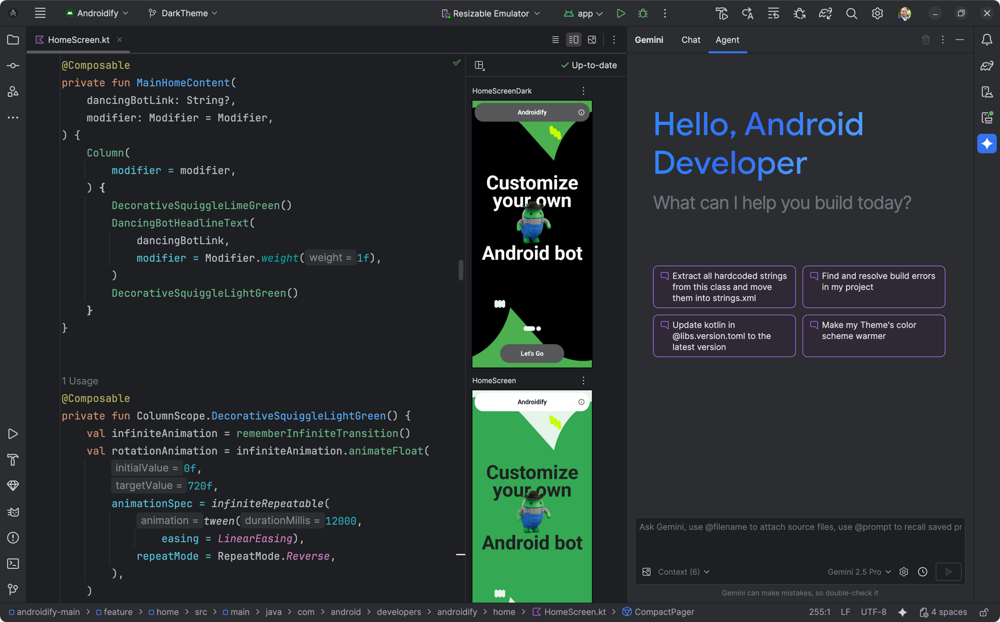
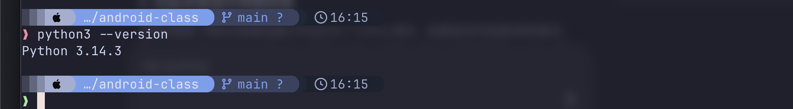
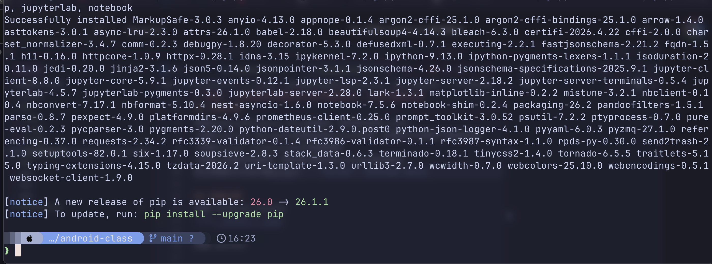
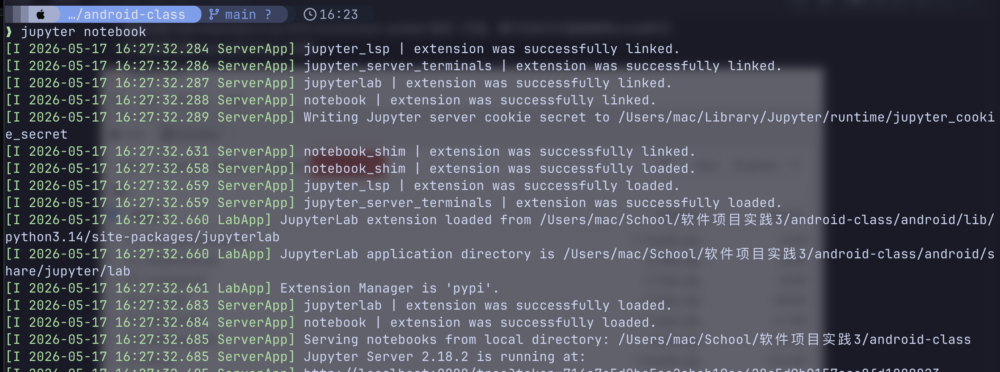
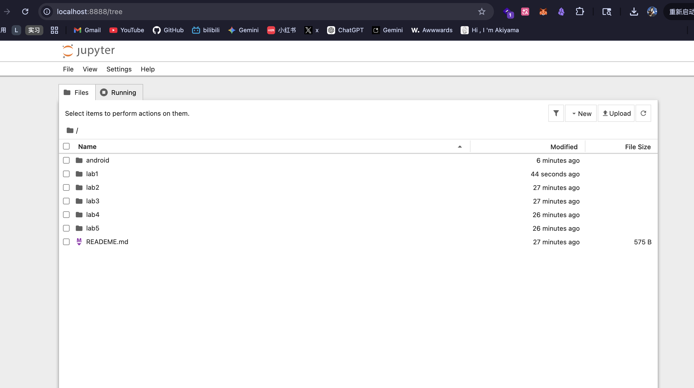
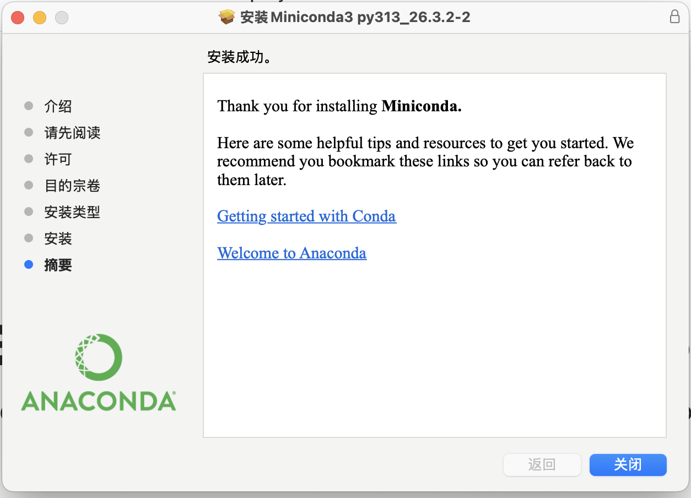
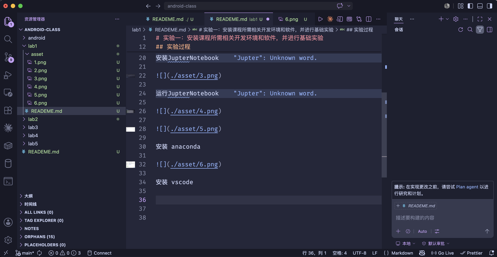

# 实验一：安装课程所需相关开发环境和软件，并进行基础实验

## 实验内容

安装AndroidStudio4.1以上的版本，更好的支持LiteRT
•安装Jupyter Notebook和相关的Python环境，后续用于机器学习模型构建
•安装Visual StudioCode代码编辑器
•探索上述软件的使用，将安装过程以Markdown语法描述，
并上传至Github(或Gitee)

## 实验过程
安装 Android Studio

安装 python

安装JupterNotebook

运行JupterNotebook

安装 anaconda

安装 vscode

