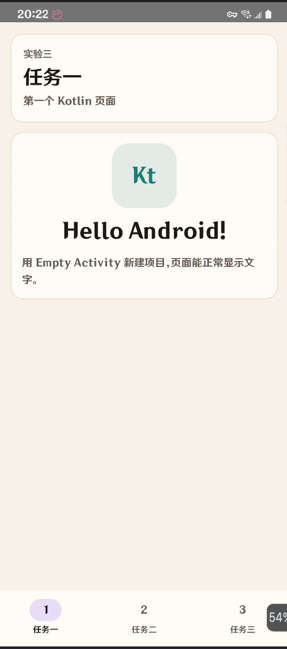
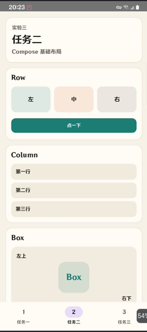
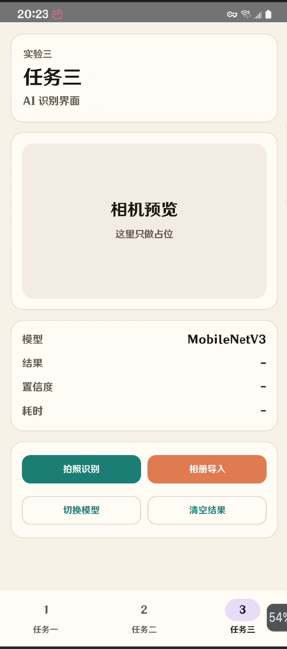

# LiteRT Lab3 - Compose 实验项目

**实验报告**

***

## 一、实验目的

1. 掌握使用 Kotlin 语言开发 Android 应用的基本流程
2. 掌握 Android Compose 布局的基本用法
3. 熟悉 Kotlin 状态管理和 Compose 组件组合

***

## 二、实验环境

| 项目                    | 版本                         |
| --------------------- | -------------------------- |
| Android SDK           | API Level 36               |
| 最低支持 SDK              | API Level 21               |
| Kotlin                | 2.2.10                     |
| Android Gradle Plugin | 9.2.1                      |
| Compose BOM           | 2024.05.00                 |
| JDK                   | 17                         |

***

## 三、实验内容与完成情况

### 3.1 任务一：创建首个 Kotlin 应用

**任务要求**：

- 创建 Empty Activity
- 使用 Kotlin 语言
- 页面显示 `Hello Android!`

**完成情况**：已完成

**运行效果**：



***

### 3.2 任务二：实践 Compose 布局

**任务要求**：

- 使用 Compose 完成页面布局
- 展示 Row、Column、Box 等基础布局
- 包含按钮和卡片效果

**完成情况**：已完成

**运行效果**：



***

### 3.3 任务三：面向 AI 应用的 Compose 布局

**任务要求**：

- 顶部显示当前任务标题
- 预览区作为相机画面占位
- 结果区显示模型、识别结果、置信度和耗时
- 按钮区包含拍照识别、相册导入、切换模型、清空结果

**完成情况**：已完成

**运行效果**：



***

## 四、项目结构

```
lab3/
├── app/
│   ├── src/
│   │   ├── main/
│   │   │   ├── java/com/example/litert/
│   │   │   │   ├── MainActivity.kt      # 主界面
│   │   │   │   ├── LabUiState.kt        # 页面状态
│   │   │   │   └── ui/theme/            # 主题配置
│   │   │   └── res/                     # 资源文件
│   │   └── test/                        # 单元测试
│   ├── build.gradle.kts
│   └── proguard-rules.pro
├── asset/                               # 实验截图
├── gradle/libs.versions.toml            # 依赖版本
├── build.gradle.kts
├── settings.gradle.kts
└── READEME.md
```

***

## 五、核心代码说明

### 5.1 MainActivity

`MainActivity` 使用 Compose 编写主界面。页面使用 `Scaffold`，底部通过 `NavigationBar` 切换三个任务页面。

### 5.2 任务一页面

任务一页面展示 `Hello Android!`，用于验证 Kotlin 应用创建和 Compose 文本显示。

### 5.3 任务二页面

任务二页面分别展示 `Row`、`Column`、`Box` 的基本用法，并加入一个按钮用于改变页面状态。

### 5.4 任务三页面

任务三页面模拟 AI 识别应用界面，包含相机预览占位、识别结果展示和四个操作按钮。

### 5.5 LabUiState

`LabUiState` 用来保存模型名、识别结果、置信度和推理耗时。按钮点击后通过状态更新刷新界面。

***

## 六、运行说明

### 6.1 构建项目

```bash
./gradlew :app:assembleDebug
```

### 6.2 运行测试

```bash
./gradlew :app:testDebugUnitTest
```

### 6.3 验证结果

本项目已通过以下命令验证：

```bash
./gradlew :app:testDebugUnitTest --tests com.example.litert.LabUiStateTest
./gradlew :app:assembleDebug
```

***

## 七、实验总结

通过本次实验，我完成了一个基于 Kotlin 和 Jetpack Compose 的 Android 应用。项目实现了三个任务页面，练习了文本显示、基础布局、按钮交互、状态更新和底部导航栏的使用。

本次实验加深了我对 Compose 声明式 UI 的理解，也熟悉了在 Kotlin 中使用 `remember`、`mutableStateOf` 等方式管理界面状态。

***

## 八、参考资源

- [Kotlin 官方文档](https://kotlinlang.org/docs/home.html)
- [Jetpack Compose 文档](https://developer.android.com/jetpack/compose)
- [Compose 布局基础](https://developer.android.com/develop/ui/compose/layouts/basics)
