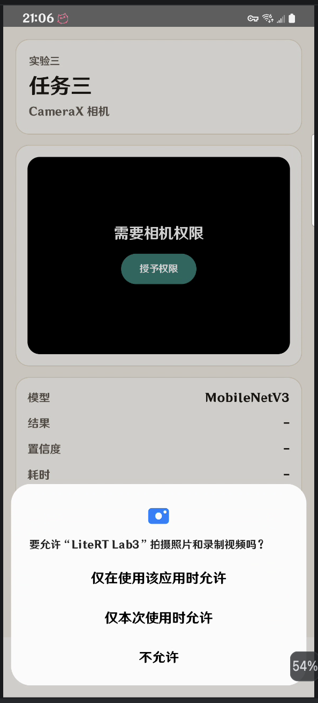
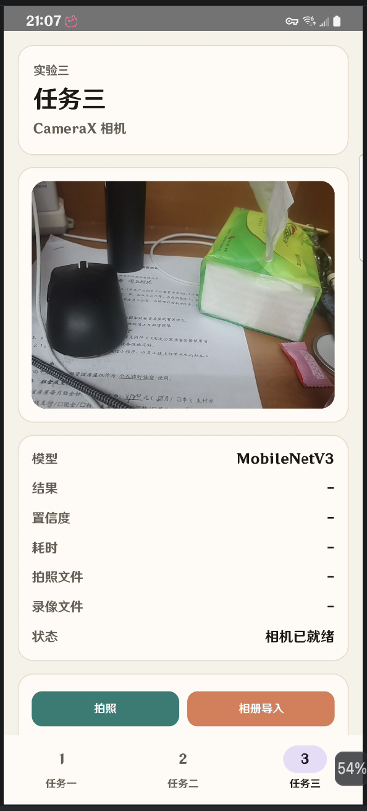
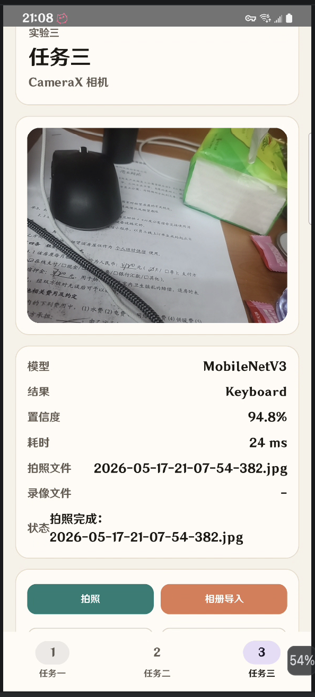
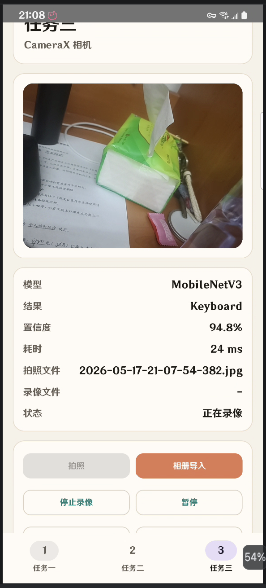

# 实验四：基于代码框架实现智能APP

## 一、实验目的

1. 在 Lab3 原有 Compose 项目基础上接入 CameraX。
2. 掌握 CameraX 的预览、拍照和录像基本用法。
3. 熟悉 Compose 中嵌入原生 Android View 的方法。
4. 练习运行时权限申请和相机状态管理。

***

## 二、实验内容

本次实验在原有底部三菜单结构基础上，保留任务一和任务二页面，将任务三从相机占位区改为真实 CameraX 相机页面。

**具体实现在 lab3里面的代码，是在这个项目里面添加的**

新增功能如下：

| 功能 | 说明 | 完成情况 |
| --- | --- | --- |
| CameraX Preview | 使用 `PreviewView` 显示实时相机画面 | 已完成 |
| ImageCapture | 点击按钮拍照，并保存到应用媒体目录 | 已完成 |
| VideoCapture | 支持开始录像、停止录像 | 已完成 |
| 暂停/继续 | 录像时支持暂停和继续 | 已完成 |
| 权限申请 | 请求相机和录音权限 | 已完成 |

***

## 三、运行效果


### 3.1 权限申请



### 3.2 相机预览



### 3.3 拍照结果



### 3.4 录像状态



***

## 四、项目改动

### 4.1 新增 CameraX 依赖

在 `gradle/libs.versions.toml` 中加入 CameraX 版本和依赖声明：

```toml
[versions]
camerax = "1.4.0"

[libraries]
androidx-camera-core = { group = "androidx.camera", name = "camera-core", version.ref = "camerax" }
androidx-camera-camera2 = { group = "androidx.camera", name = "camera-camera2", version.ref = "camerax" }
androidx-camera-lifecycle = { group = "androidx.camera", name = "camera-lifecycle", version.ref = "camerax" }
androidx-camera-video = { group = "androidx.camera", name = "camera-video", version.ref = "camerax" }
androidx-camera-view = { group = "androidx.camera", name = "camera-view", version.ref = "camerax" }
```

在 `app/build.gradle.kts` 中使用这些依赖：

```kotlin
implementation(libs.androidx.camera.core)
implementation(libs.androidx.camera.camera2)
implementation(libs.androidx.camera.lifecycle)
implementation(libs.androidx.camera.video)
implementation(libs.androidx.camera.view)
```

### 4.2 添加权限

在 `AndroidManifest.xml` 中声明相机和录音权限：

```xml
<uses-permission android:name="android.permission.CAMERA" />
<uses-permission android:name="android.permission.RECORD_AUDIO" />

<uses-feature
    android:name="android.hardware.camera.any"
    android:required="false" />
```

其中：

- `CAMERA` 用于相机预览和拍照。
- `RECORD_AUDIO` 用于录像时录制声音。
- `camera.any` 表示应用会使用摄像头。

***

## 五、关键代码实现

### 5.1 权限检查与申请

Compose 中使用 `rememberLauncherForActivityResult` 申请权限：

```kotlin
private val REQUIRED_PERMISSIONS = arrayOf(
    Manifest.permission.CAMERA,
    Manifest.permission.RECORD_AUDIO
)

private fun hasCameraPermissions(context: Context): Boolean =
    REQUIRED_PERMISSIONS.all {
        ContextCompat.checkSelfPermission(context, it) == PackageManager.PERMISSION_GRANTED
    }
```

任务三页面进入后，如果还没有权限，就主动弹出权限申请：

```kotlin
val permissionLauncher = rememberLauncherForActivityResult(
    contract = ActivityResultContracts.RequestMultiplePermissions()
) { grants ->
    cameraState = if (grants.values.all { it }) {
        cameraState.permissionGranted()
    } else {
        cameraState.permissionDenied()
    }
}

LaunchedEffect(Unit) {
    if (!hasCameraPermissions(context)) {
        permissionLauncher.launch(REQUIRED_PERMISSIONS)
    }
}
```

### 5.2 在 Compose 中显示 PreviewView

CameraX 的 `PreviewView` 是传统 Android View，Compose 中通过 `AndroidView` 嵌入：

```kotlin
val previewView = remember {
    PreviewView(context).apply {
        scaleType = PreviewView.ScaleType.FILL_CENTER
    }
}

AndroidView(
    factory = { previewView },
    modifier = Modifier.fillMaxSize()
)
```

### 5.3 绑定 CameraX 用例

本项目绑定了三个 CameraX 用例：

- `Preview`：相机实时预览
- `ImageCapture`：拍照
- `VideoCapture`：录像

关键代码如下：

```kotlin
private fun bindCameraUseCases(
    context: Context,
    lifecycleOwner: LifecycleOwner,
    previewView: PreviewView,
    onUseCasesReady: (ImageCapture, VideoCapture<Recorder>) -> Unit,
    onError: (String) -> Unit
) {
    val cameraProviderFuture = ProcessCameraProvider.getInstance(context)
    cameraProviderFuture.addListener({
        try {
            val cameraProvider = cameraProviderFuture.get()
            val preview = Preview.Builder()
                .build()
                .also { it.setSurfaceProvider(previewView.surfaceProvider) }
            val imageCapture = ImageCapture.Builder()
                .setCaptureMode(ImageCapture.CAPTURE_MODE_MINIMIZE_LATENCY)
                .build()
            val recorder = Recorder.Builder().build()
            val videoCapture = VideoCapture.withOutput(recorder)

            cameraProvider.unbindAll()
            cameraProvider.bindToLifecycle(
                lifecycleOwner,
                CameraSelector.DEFAULT_BACK_CAMERA,
                preview,
                imageCapture,
                videoCapture
            )
            onUseCasesReady(imageCapture, videoCapture)
        } catch (exception: Exception) {
            onError("相机启动失败：${exception.message ?: "未知错误"}")
        }
    }, ContextCompat.getMainExecutor(context))
}
```

### 5.4 拍照功能

拍照时先创建图片文件，再调用 `ImageCapture.takePicture()`：

```kotlin
private fun takePhoto(
    context: Context,
    imageCapture: ImageCapture?,
    onSaved: (String) -> Unit,
    onError: (String) -> Unit
) {
    val capture = imageCapture ?: run {
        onError("相机还没准备好")
        return
    }
    val photoFile = createMediaFile(context, "jpg")
    val outputOptions = ImageCapture.OutputFileOptions.Builder(photoFile).build()

    capture.takePicture(
        outputOptions,
        ContextCompat.getMainExecutor(context),
        object : ImageCapture.OnImageSavedCallback {
            override fun onImageSaved(outputFileResults: ImageCapture.OutputFileResults) {
                onSaved(photoFile.name)
            }

            override fun onError(exception: ImageCaptureException) {
                onError("拍照失败：${exception.message ?: "未知错误"}")
            }
        }
    )
}
```

拍照完成后，页面会显示保存的文件名，并同步更新识别结果区域。

### 5.5 录像功能

录像使用 `VideoCapture<Recorder>`，保存为 MP4 文件：

```kotlin
@SuppressLint("MissingPermission")
private fun startRecording(
    context: Context,
    videoCapture: VideoCapture<Recorder>?,
    onRecordingCreated: (Recording) -> Unit,
    onStarted: () -> Unit,
    onFinalized: (String) -> Unit,
    onError: (String) -> Unit
) {
    val capture = videoCapture ?: run {
        onError("录像还没准备好")
        return
    }
    val videoFile = createMediaFile(context, "mp4")
    val outputOptions = FileOutputOptions.Builder(videoFile).build()

    val recording = capture.output
        .prepareRecording(context, outputOptions)
        .withAudioEnabled()
        .start(ContextCompat.getMainExecutor(context)) { event ->
            when (event) {
                is VideoRecordEvent.Start -> onStarted()
                is VideoRecordEvent.Finalize -> {
                    if (event.hasError()) {
                        onError("录像失败：${event.error}")
                    } else {
                        onFinalized(videoFile.name)
                    }
                }
            }
        }
    onRecordingCreated(recording)
}
```

停止录像时调用：

```kotlin
recording?.stop()
```

暂停和继续录像使用：

```kotlin
recording?.pause()
recording?.resume()
```

### 5.6 文件保存

图片和视频保存到应用的外部文件目录：

```kotlin
private fun createMediaFile(context: Context, extension: String): File {
    val directory = context.getExternalFilesDir(null) ?: context.filesDir
    val timeStamp = SimpleDateFormat("yyyy-MM-dd-HH-mm-ss-SSS", Locale.CHINA)
        .format(System.currentTimeMillis())
    return File(directory, "$timeStamp.$extension")
}
```

文件名格式示例：

```text
2026-05-17-14-30-20-123.jpg
2026-05-17-14-30-25-456.mp4
```

### 5.7 相机状态管理

新增 `CameraUiState` 保存权限、录像状态、文件名和提示信息：

```kotlin
data class CameraUiState(
    val hasPermission: Boolean = false,
    val recordingStatus: RecordingStatus = RecordingStatus.Idle,
    val lastPhotoName: String = "",
    val lastVideoName: String = "",
    val message: String = "等待相机权限"
)

enum class RecordingStatus {
    Idle,
    Recording,
    Paused
}
```

状态变化通过函数完成，例如：

```kotlin
fun photoSaved(fileName: String): CameraUiState = copy(
    lastPhotoName = fileName,
    message = "拍照完成：$fileName"
)

fun recordingStarted(): CameraUiState = copy(
    recordingStatus = RecordingStatus.Recording,
    message = "正在录像"
)
```

***

## 六、测试与构建

新增单元测试 `CameraUiStateTest`，用于验证相机页面状态变化：

```kotlin
@Test
fun recordingFlow_updatesStatusText() {
    val state = CameraUiState(hasPermission = true)

    val recording = state.recordingStarted()
    val paused = recording.recordingPaused()
    val resumed = paused.recordingResumed()
    val stopped = resumed.recordingStopped("video.mp4")

    assertEquals(RecordingStatus.Recording, recording.recordingStatus)
    assertEquals(RecordingStatus.Paused, paused.recordingStatus)
    assertEquals(RecordingStatus.Recording, resumed.recordingStatus)
    assertEquals(RecordingStatus.Idle, stopped.recordingStatus)
    assertEquals("video.mp4", stopped.lastVideoName)
}
```

验证命令：

```bash
./gradlew :app:testDebugUnitTest --tests com.example.litert.CameraUiStateTest
./gradlew :app:assembleDebug
```

验证结果：

```text
BUILD SUCCESSFUL
```

***

## 七、实验总结

本次实验在原有 Compose 项目上完成了 CameraX 功能扩展。任务三页面现在可以直接显示相机预览，并支持拍照、录像、暂停和继续录像。

通过本次实验，我熟悉了 CameraX 的基本使用流程，也理解了 Compose 项目中如何嵌入 `PreviewView` 这类传统 Android View。相比 XML 布局版本，Compose 写法更集中，状态更新也更直观。

***

## 八、参考内容

- Android CameraX Preview、ImageCapture、VideoCapture 用法
- Jetpack Compose `AndroidView` 用法
